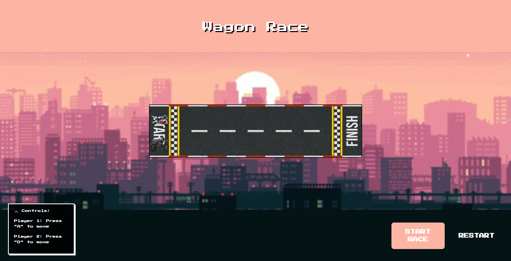

# 🚗 Wagon Racer

Welcome to **Wagon Racer**, a browser game where players race their wagons to the finish line by tapping keys on their keyboard. The faster you tap, the faster your wagon moves! 🏁

Race against the clock, and make sure to avoid obstacles to secure your place in the leaderboard! 🎮

⚡ Ready to race? Tap the keys, race to the finish line, and enjoy the ride!

## 🎮 Game Controls

- **Player 1:** Press **A** to control your wagon.
- **Player 2:** Press **D** to control your wagon.

Race against each other and see who reaches the finish line first! 🚀

## 🎵 Custom Sounds & Music

- **Background Music:**
  Added custom background music to enhance the gaming experience. The track plays throughout the game, immersing you in the racing atmosphere. You can toggle the music on or off with a simple button in the game!

- **Sound Effects:**
  Custom sound effects have been added for actions like starting the race, crossing checkpoints, and winning the race. The sound effects bring the game to life and add to the excitement!

These sound features are included to make the game more engaging and provide an immersive experience for the players.

## 🎨 Visual Effects

- **Moving Background:**
  To make the racing experience even more dynamic, a moving background has been added. As players race their wagons, the background shifts to simulate movement, giving the game a more realistic and exciting feel.

## 🏗 Technologies Used

- HTML5 - Structure & Markup
- CSS3 - Styling & Layout
- JavaScript - Game Mechanics & Interactivity
- Custom Sound Effects - Background Music & Game Sounds

## 📸 Screenshot

Here’s a preview of **Wagon Racer** in action:

